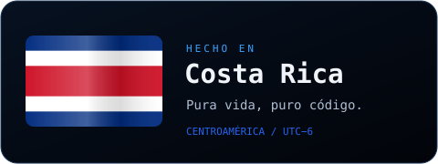
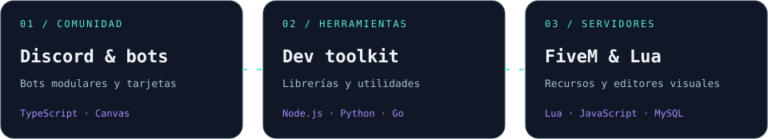
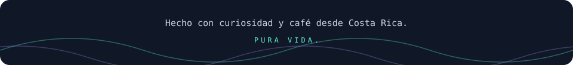

  

  <a href="https://github.com/Oscar-Dev0?tab=repositories">Explorá mis proyectos</a> ·
  <a href="https://discord.com/users/518251720128856084">Conectemos en Discord</a>

## ¡Pura vida! Soy Oscar 👋

Desarrollador de **Costa Rica 🇨🇷**, con **<!-- AGE:START -->22<!-- AGE:END --> años** y muchas ideas por convertir en código. Me gusta crear bots para Discord, desarrollar herramientas reutilizables y ayudar a otras personas con sus problemas de programación.

Mis repositorios van desde **librerías en TypeScript** hasta **recursos para FiveM en Lua** y **herramientas en Python**. También he explorado Go, aplicaciones en C# y proyectos web con JavaScript.

  

### Lo que me gusta construir

- **Experiencias para comunidades:** bots modulares y tarjetas de bienvenida, niveles y rankings para Discord.
- **Utilidades que se pueden reutilizar:** herramientas de consola, plantillas y pequeñas librerías para otros proyectos.
- **Recursos para servidores:** sistemas de FiveM con interfaces, editores visuales y persistencia de datos.
- **Ideas para aprender:** experimentar con distintos lenguajes y compartir código que pueda servirle a alguien más.

  

## Proyectos para explorar

Una selección de mis repositorios públicos. Cada enlace lleva al código y su documentación.

| Proyecto | Qué podés encontrar | Tecnología |
| :--- | :--- | :--- |
| [🛡️ os_safezone](https://github.com/Oscar-Dev0/os_safezone) | Zonas seguras para FiveM, con editor visual, geometría 3D y persistencia en MySQL. | Lua · JavaScript · MySQL |
| [🧰 weapon_rebalancer](https://github.com/Oscar-Dev0/weapon_rebalancer) | Herramienta para auditar y ajustar archivos META de armas en FiveM, con previsualización y validaciones. | Python |
| [🎨 discord_cards](https://github.com/Oscar-Dev0/discord_cards) | Librería de tarjetas de bienvenida, niveles y rankings para Discord, generadas con Canvas. | TypeScript · Canvas |
| [⌘ console](https://github.com/Oscar-Dev0/console) | Utilidades para dar estilo a la consola de Node.js: colores, texto centrado y recuadros. | TypeScript · Node.js |
| [🤖 Base modular con Seyfert](https://github.com/Oscar-Dev0/seyfert-Bot-Base-Modular-Discord) | Una base modular para empezar a desarrollar un bot de Discord. | TypeScript · Seyfert |
| [⚡ Plantilla-bot-bun](https://github.com/Oscar-Dev0/Plantilla-bot-bun) | Plantilla de bots con discord.js para el runtime Bun. | TypeScript · Bun |

También podés revisar [bot-plantilla](https://github.com/Oscar-Dev0/bot-plantilla), mis proyectos en Go [cards](https://github.com/Oscar-Dev0/cards) y [zeew-api-go](https://github.com/Oscar-Dev0/zeew-api-go), o mis **ediciones y mantenimiento** de [os_multijob](https://github.com/Oscar-Dev0/os_multijob), una app de trabajos para LB-Phone basada en trabajo de la comunidad.

**[Ver todos los repositorios →](https://github.com/Oscar-Dev0?tab=repositories)**

### Un vistazo más de cerca

**🛡️ Sistemas que se pueden administrar visualmente.** En `os_safezone` trabajo con zonas seguras para FiveM: creación de polígonos, cámaras de previsualización, reglas por zona y almacenamiento en MySQL. `weapon_rebalancer` complementa ese lado de servidores con auditorías y ajustes de archivos META.

**🎨 Discord también tiene un lado visual.** En `discord_cards` hay tarjetas de miembros, niveles y rankings construidas con Canvas. Las bases con Seyfert y discord.js reúnen el otro lado: la estructura y el comportamiento de los bots.

**⌘ Pequeñas herramientas, usos concretos.** `console` permite centrar texto, dibujar recuadros y aplicar colores en Node.js. Es parte de mi interés por crear utilidades que pueda llevar de un proyecto a otro.

## Mi caja de herramientas

  
  
  
  
  
  

- **Bots y comunidad:** Discord, discord.js, Seyfert y Canvas.
- **Herramientas y ejecución:** Node.js, Bun, Git y GitHub.
- **Servidores de juego:** FiveM, Lua y MySQL.

  

## Hablemos

  

<a href="https://discord.com/users/518251720128856084">Conectemos en Discord</a> Avatar, nombre, usuario y banner actualizados cada 10 días · Sin estado de conexión en tiempo real.

¿Estás construyendo un bot, probando alguno de mis proyectos o querés compartir una idea? Podés encontrarme en [Discord](https://discord.com/users/518251720128856084). Para reportar un problema de código, abrí un issue en el repositorio correspondiente con los pasos para reproducirlo.

  

<!-- Mantenimiento del perfil: ver docs/profile-maintenance.md. -->
