

  <picture>
    <source media="(max-width: 600px)" srcset="assets/svg/header-mobile.svg" />
    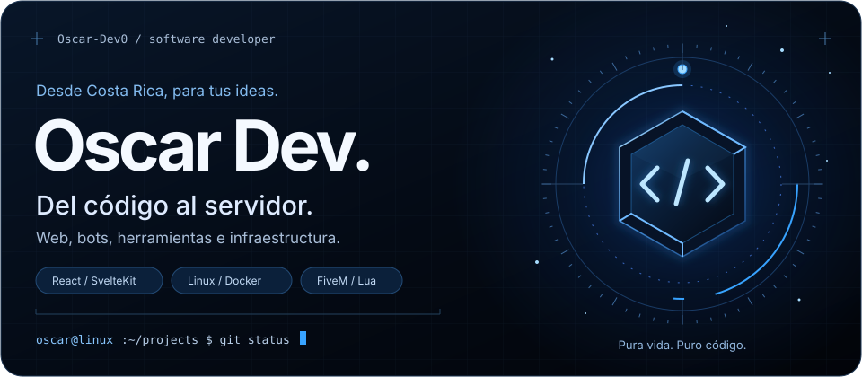
  </picture>

  <a href="https://github.com/Oscar-Dev0?tab=repositories"><picture><source media="(max-width: 600px)" srcset="assets/svg/link-projects-mobile.svg" />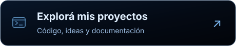</picture></a>
  <a href="https://discord.com/users/518251720128856084"><picture><source media="(max-width: 600px)" srcset="assets/svg/link-discord-mobile.svg" />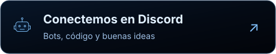</picture></a>

## ¡Pura vida! Soy Oscar 👋

Soy **programador de Costa Rica 🇨🇷**, con **<!-- AGE:START -->22<!-- AGE:END --> años**. Trabajo en desarrollo web, bots para Discord, herramientas reutilizables y recursos para FiveM. También me gusta ayudar a otras personas a resolver sus problemas de programación.

Me muevo entre **React y SvelteKit**, la **terminal de Linux**, los **contenedores con Docker** y **Windows Server**. Disfruto conectar una buena interfaz con el código y el entorno que la hacen funcionar.

  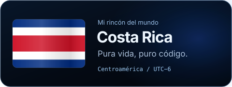

### Mi stack, desde la terminal

  <picture>
    <source media="(max-width: 600px)" srcset="assets/svg/terminal-mobile.svg" />
    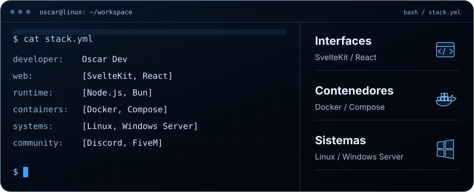
  </picture>

Trabajo tanto con el **código de las aplicaciones** como con sus **entornos de ejecución**: desarrollo web, terminales, contenedores y servidores.

### Lo que construyo y con qué trabajo

  <picture>
    <source media="(max-width: 600px)" srcset="assets/svg/workbench-mobile.svg" />
    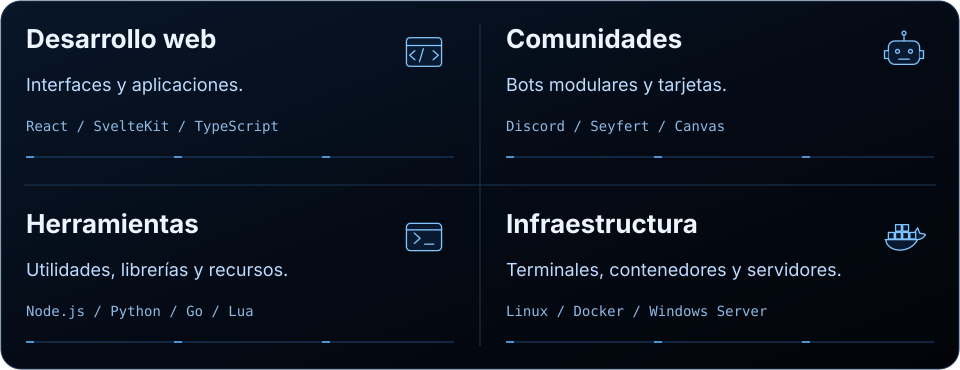
  </picture>

| Me gusta construir | Lo que hay detrás |
| :--- | :--- |
| **Interfaces y aplicaciones web** | React, SvelteKit, JavaScript y TypeScript para construir experiencias web. |
| **Comunidades con personalidad** | Bots modulares, bienvenidas, niveles y rankings para Discord. |
| **Herramientas que se pueden reutilizar** | Utilidades de consola, plantillas y librerías para simplificar otros proyectos. |
| **Infraestructura y entornos de trabajo** | Linux, Docker, Docker Compose y Windows Server. |
| **Mundos que funcionan** | Recursos de FiveM con interfaces, editores visuales y persistencia de datos. |

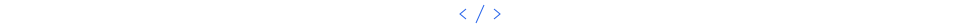

## Proyectos para explorar

Ocho proyectos para recorrer mis áreas de trabajo: Discord, herramientas, FiveM, React y contenedores Linux. Abrí una tarjeta para ver el código y su documentación.

<table>
  <tr>
    <td width="50%" valign="top">
      <a href="https://github.com/Oscar-Dev0/os_safezone"><picture><source media="(max-width: 600px)" srcset="assets/svg/project-safezone-mobile.svg" />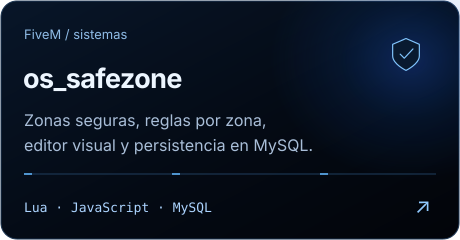</picture></a>
      
<a href="https://github.com/Oscar-Dev0/os_safezone"><strong>os_safezone</strong></a> Zonas seguras con geometría 3D, cámaras de previsualización y reglas configurables.

    </td>
    <td width="50%" valign="top">
      <a href="https://github.com/Oscar-Dev0/weapon_rebalancer"><picture><source media="(max-width: 600px)" srcset="assets/svg/project-rebalancer-mobile.svg" />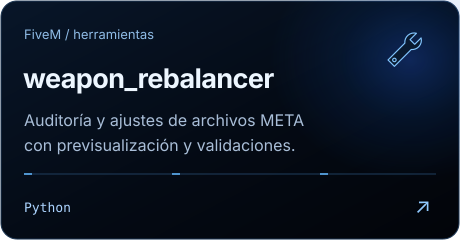</picture></a>
      
<a href="https://github.com/Oscar-Dev0/weapon_rebalancer"><strong>weapon_<wbr />rebalancer</strong></a> Auditoría de archivos META y conflictos de runtime, con previsualización y copias de respaldo.

    </td>
  </tr>
  <tr>
    <td width="50%" valign="top">
      <a href="https://github.com/Oscar-Dev0/discord_cards"><picture><source media="(max-width: 600px)" srcset="assets/svg/project-cards-mobile.svg" />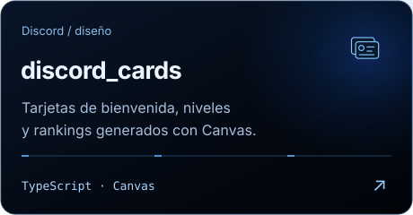</picture></a>
      
<a href="https://github.com/Oscar-Dev0/discord_cards"><strong>discord_cards</strong></a> Tarjetas de miembros, niveles y rankings; contribuciones a una librería con Canvas.

    </td>
    <td width="50%" valign="top">
      <a href="https://github.com/Oscar-Dev0/console"><picture><source media="(max-width: 600px)" srcset="assets/svg/project-console-mobile.svg" />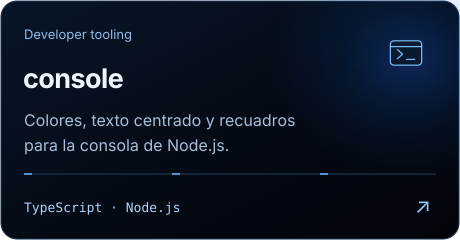</picture></a>
      
<a href="https://github.com/Oscar-Dev0/console"><strong>console</strong></a> Pequeñas utilidades para dar forma y claridad a la salida de tus herramientas.

    </td>
  </tr>
  <tr>
    <td width="50%" valign="top">
      <a href="https://github.com/Oscar-Dev0/seyfert-Bot-Base-Modular-Discord"><picture><source media="(max-width: 600px)" srcset="assets/svg/project-seyfert-mobile.svg" />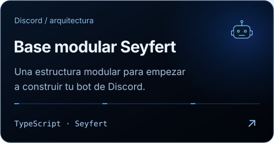</picture></a>
      
<a href="https://github.com/Oscar-Dev0/seyfert-Bot-Base-Modular-Discord"><strong>Base modular con Seyfert</strong></a> Un punto de partida organizado para desarrollar tu próximo bot.

    </td>
    <td width="50%" valign="top">
      <a href="https://github.com/Oscar-Dev0/Plantilla-bot-bun"><picture><source media="(max-width: 600px)" srcset="assets/svg/project-bun-mobile.svg" />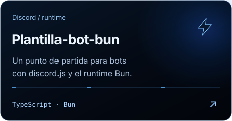</picture></a>
      
<a href="https://github.com/Oscar-Dev0/Plantilla-bot-bun"><strong>Plantilla-bot-bun</strong></a> Una base para experimentar con discord.js sobre el runtime Bun.

    </td>
  </tr>
  <tr>
    <td width="50%" valign="top">
      <a href="https://github.com/Oscar-Dev0/LinuxConteiner"><picture><source media="(max-width: 600px)" srcset="assets/svg/project-linux-mobile.svg" />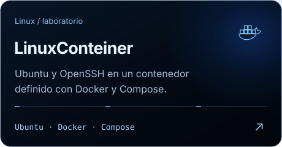</picture></a>
      
<a href="https://github.com/Oscar-Dev0/LinuxConteiner"><strong>LinuxConteiner</strong></a> Un laboratorio de Ubuntu y OpenSSH en un contenedor, definido con Dockerfile y Compose.

    </td>
    <td width="50%" valign="top">
      <a href="https://github.com/Oscar-Dev0/Todo"><picture><source media="(max-width: 600px)" srcset="assets/svg/project-react-mobile.svg" />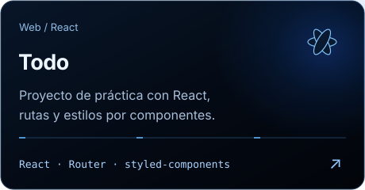</picture></a>
      
<a href="https://github.com/Oscar-Dev0/Todo"><strong>Todo · React</strong></a> Práctica de desarrollo web con React, React Router y styled-components.

    </td>
  </tr>
</table>

  
<strong>Más código para curiosear</strong>

| Repositorio | Qué podés explorar |
| :--- | :--- |
| [os_chargename](https://github.com/Oscar-Dev0/os_chargename) | Panel de cambio de nombre para FiveM, con interfaz NUI, registros y oxmysql. |
| [packet-tracer](https://github.com/Oscar-Dev0/packet-tracer) | Apuntes de redes sobre DHCP y DNS. |
| [bot-plantilla](https://github.com/Oscar-Dev0/bot-plantilla) | Otra base para desarrollar bots de Discord. |
| [cards](https://github.com/Oscar-Dev0/cards) | Mis experimentos con tarjetas en Go. |
| [zeew-api-go](https://github.com/Oscar-Dev0/zeew-api-go) | Un proyecto de API en Go. |
| [os_multijob](https://github.com/Oscar-Dev0/os_multijob) | Mis **ediciones y mantenimiento** de una app de trabajos para LB-Phone, basada en trabajo de la comunidad. |

<a href="https://github.com/Oscar-Dev0?tab=repositories"><strong>Ver todos mis repositorios ↗</strong></a>

## Mi caja de herramientas

  <picture>
    <source media="(max-width: 600px)" srcset="assets/svg/toolkit-mobile.svg" />
    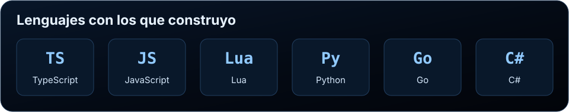
  </picture>

  <picture>
    <source media="(max-width: 600px)" srcset="assets/svg/platforms-mobile.svg" />
    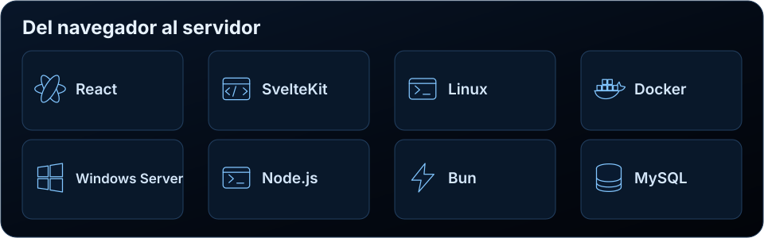
  </picture>

| Área | Mi stack | Para qué lo uso |
| :--- | :--- | :--- |
| **Desarrollo web** | React · SvelteKit · TypeScript · JavaScript | Interfaces y aplicaciones web. |
| **Bots y comunidad** | Discord · discord.js · Seyfert · Canvas | Bots modulares, tarjetas y herramientas para comunidades. |
| **Herramientas y APIs** | Node.js · Bun · Python · Go | Librerías, utilidades de consola e integraciones. |
| **Contenedores** | Docker · Docker Compose | Entornos de trabajo definidos en contenedores. |
| **Sistemas y servidores** | Linux · Windows Server | Trabajo con terminales y entornos de servidor. |
| **FiveM y datos** | Lua · JavaScript · MySQL · oxmysql | Recursos, interfaces NUI y persistencia. |
| **Otros proyectos** | C# · Go | Aplicaciones y experimentos para seguir aprendiendo. |

### Algunos stacks en mis repositorios

| Proyecto | Stack que podés ver en el código |
| :--- | :--- |
| [Todo](https://github.com/Oscar-Dev0/Todo) | React · React Router · styled-components |
| [LinuxConteiner](https://github.com/Oscar-Dev0/LinuxConteiner) | Ubuntu · OpenSSH · Docker · Compose |
| [console](https://github.com/Oscar-Dev0/console) | TypeScript · Node.js · kleur · tsup |
| [discord_cards](https://github.com/Oscar-Dev0/discord_cards) | TypeScript · skia-canvas · tsup |
| [os_safezone](https://github.com/Oscar-Dev0/os_safezone) | Lua · JavaScript · FiveM · MySQL |
| [os_chargename](https://github.com/Oscar-Dev0/os_chargename) | Lua · JavaScript · NUI · oxmysql |

### Pensar. Construir. Compartir.

Entender el problema, probar una solución y compartir lo aprendido. Así paso de una idea a algo que pueda servirle a alguien más.

  <picture>
    <source media="(max-width: 600px)" srcset="assets/svg/code-lab-mobile.svg" />
    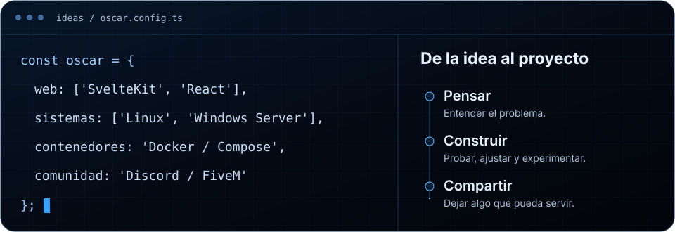
  </picture>

## Hablemos

¿Estás construyendo una web, un bot, un recurso para FiveM o querés conversar sobre Linux y contenedores? **[Encontrame en Discord](https://discord.com/users/518251720128856084)** y conversemos.

  <a href="https://discord.com/users/518251720128856084">
    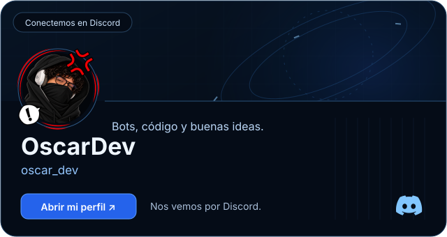
  </a>

<a href="https://discord.com/users/518251720128856084">Conectemos en Discord ↗</a> Nombre, avatar y banner sincronizados cada 10 días. La tarjeta no muestra presencia en tiempo real.

Para reportar un problema de código, abrí un **issue en el repositorio correspondiente** con los pasos para reproducirlo.

  <picture><source media="(max-width: 600px)" srcset="assets/svg/footer-mobile.svg" />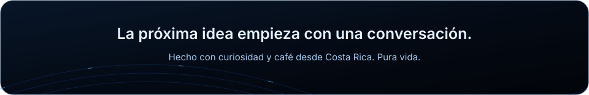</picture>

<!-- Mantenimiento del perfil: ver docs/profile-maintenance.md. -->
